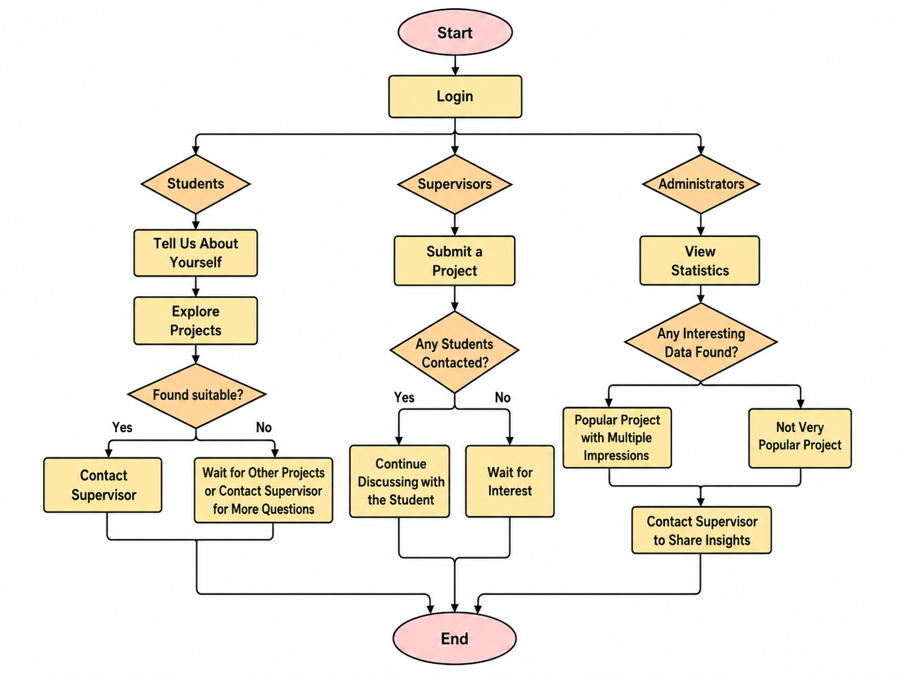

# FindMyFYP

FindMyFYP is a web platform that helps university students discover suitable
Final Year Projects (FYPs) based on the skills they already have, the
skills they want to learn and their personal interests. Instead of scrolling
through a long, flat list of project titles, students fill in a short profile
and receive every available project  so the best fits rise to the top. Teachers also 
can submit projects inside and allow students to match with them.


# Problem & Motivation

Issues with current FYP matching:

- 1. Information overload- Project lists are circulated as long PDFs,
  spreadsheets, or notice-board posts containing dozens of titles. There is
  no way to filter, search, or compare them against your own background

- 2. Poor fit- Students frequently choose based on the title alone, and
  only discover weeks later that the project requires skills they don't have
  A bad fit leads to lower grades, higher stress, and sometimes a mid-semester change of topic.

- 3. First-come-first-served pressure- Popular supervisors fill their
  quotas within days. The pressure to "lock in" a project quickly rewards
  speed over informed decision-making.

- 4. No visibility for supervisors- Supervisors publish a title and a
  paragraph, then wait. They have no structured way to see which students
  are genuinely suited to (or interested in) their projects until students
  email them one by one

# Aim

We aim to develop a centralized and intelligent platform that improves the project-student
matching process. Instead of a simple project list, the system will use AI (NLP) to match
project requirements with student skills and provide recommended Coursera courses to help
students fill any skill gaps.
The system will enable students to:
● Select projects that match their skills, interests, and career goals
● Filter projects based on skills they already have or want to learn
● Clearly understand project requirements and expectations
● Identify skill gaps and receive relevant Coursera course recommendations
● Make better decisions using real-time project demand insights
● Discover and connect with potential teammates for interdisciplinary projects
The system will enable the supervisors to:
● Provide clear visibility of the project to the students
● Identify and select the suitable students for the project
Overall, the goal is to transform the FYP selection process into a more personalized,
transparent, and intelligent system that improves both student experience and project
outcomes.

### Proposed Core Features / User Stories

#### Student/Supervisor stories

1. As a Student who wants to choose a suitable FYP project, I want to receive
personalized project recommendations, so that I can make informed decisions.
2. As a Student, I want to filter projects by “Skills I have” and “Skills I want to learn”, so
that my project aligns with my career goals.
3. As a Student, I want to see a Skill Analysis, so that I understand what I need to learn
before starting the project.
4. As a Student, I want to receive recommended Coursera courses, so that I can prepare
effectively.
5. As a Student, I want to see a real-time demand heatmap (project popularity), so that I
can manage expectations and bid strategically.
6. As a Student, I want a simple explanation of complex project descriptions, so that I can
better understand them.
7. As a Student, I want an interface to discover and connect with potential teammates or
students with similar projects, so that I can form a team or discuss ideas.
8. As a Supervisor, I want my project to be automatically tagged with relevant technical
keywords, so that it attracts students with the right background.


Features


2. Feature 1 (core): Student Profiling & Filtering. Students can input their current skills,
interests, and the skills they want to learn. The system will use this information to filter
and show relevant projects.
3. Feature 2 (core)-Teachers can submit their projects which in return students can view and connect with them
4. Feature 3 (extension): Skills Analysis. The system will show the skills needed for the
project, difference between the student’s current skills and the skills required for each
project. This helps students understand what they need to learn.
5. Feature 4 (extension): Coursera Course Recommendation. Based on the skills, the
system will suggest relevant Coursera courses to help students prepare for the project.
6. Feature 5 (extension): Real-Time Demand Heatmap. Students can show interest in
projects, and the system will display how many students are interested in each project.
This helps students understand competition levels. And also the admi can see these statistics


## High-level architecture

```
┌──────────────────────┐         JSON over HTTP         ┌──────────────────────┐
│   React SPA (Vite)   │  ───────────────────────────►  │   FastAPI backend    │
│  Tailwind + shadcn   │  ◄───────────────────────────  │      (Python)        │
│   localhost:5173     │        CORS-restricted         │    localhost:8000    │
└──────────────────────┘                                └──────────┬───────────┘
        │                                                          │
        │  localStorage                                            │  sqlite3 (stdlib)
        ▼                                                          ▼
┌──────────────────────┐                                ┌──────────────────────┐
│  "session" = stored  │                                │     findmyfyp.db     │
│      user object     │                                │  (single SQLite file)│
└──────────────────────┘                                └──────────────────────┘
```

## Entity Relationship Diagram

The SQLite database  has two tables with 1 relationship. - users and projects A supervisor is simply a
`users` row with role = 'supervisor'. Projects link to their supervisor
by email 

```
        users                                       projects
+-----------------------+                +----------------------------------+
| PK id        INTEGER  |                | PK id                  INTEGER   |
|    name      TEXT      |                |    title               TEXT      |
|    email     TEXT (UK) |                |    supervisor_name     TEXT      |
|    password  TEXT      |                | FK contact_email       TEXT      |
|    role      TEXT      |                |    description         TEXT      |
+-----------------------+                |    required_skills     TEXT      |
           │                             |    languages           TEXT      |
           │  email = contact_email      |    prerequisite_knowledge TEXT   |
           │  (soft link, not enforced)  |    expected_deliverables  TEXT   |
           │                             |    domain_keywords     TEXT      |
           └──── 1 ───────────< many ────|    difficulty          TEXT      |
       one supervisor   has many projects +----------------------------------+
```

Timeline

Milestone 1 – Technical Proof of Concept
In this phase, a basic system will be built to show end-to-end functionality. It will include a
simple interface to view project descriptions and enter student profiles, along with backend
integration. Basic skill and keyword extraction will be implemented at a simple level.
➔ Feature 1 (Project Skill Extraction) will be implemented at a basic level.
➔ Feature 2 (Student Profiling) will be implemented at an initial level.

Milestone 2 – Prototype
In this phase, the main functionality of the system will be developed. The project
recommendation engine will match students to projects and provide a ranked list based on
skills and interests. Filtering features will be fully available and skill extraction will be done
➔ Feature 1 will be completed at an advanced level.
➔ Feature 2 will be fully implemented.
➔ Feature 3  will be completed.

Milestone 3 – Extended System
In this phase, advanced features will be added to improve usability.  heatmap to show project popularity. and bug fixes
➔ Feature 4 and 5 will be completed


## Tech Stack

Frontend

- React 19 — UI library
- Vite 6 — build tool / dev server
- Tailwind CSS 4 styling, plus tw-animate-css for animations
- shadcn/ui-style components 

Backend

- Python with FastAPI 

Database

- SQLite

## User Flow




## Some tech stack details

Architecture

"It's a React + Vite single-page frontend talking over JSON to a FastAPI Python backend, with SQLite as the database.


Login / password security

For login, passwords are never stored as plain text. When a user registers, the password is run through hashing using Python's built-in hashlib library in our FastAPI backend, and only the resulting hash is saved in the database


SQL injection protection

All database queries use parameterized queries (the ? placeholders) rather than string concatenation, which protects against SQL injection

Role-based access

On the login screen the user first picks a role student, supervisor, or admin. The role is validated against an allowed list both on the frontend and backend and the database itself enforces it with a CHECK constraint. Admins are routed to the Statistics dashboard; everyone else goes to their respective dashboard

Session handling

We keep a lightweight session by storing the logged-in user object in the browser's localStorag so the app remembers who's logged in across pages

Project matching ( core Feature)

When a student enters the skills they have, skills they want to learn, and interests, our backend scores every project. It's a keyword-matching algorithm: 70% of the score comes from how many of the project's required skills match the student's keywords, and 30% from keywords appearing in the project description. Projects are then ranked best-match-first (matching.py)

Statistics / demand heatmap (admin)

The admin Statistics page aggregates live data of total users, total projects, a breakdown of users by role, and the most in-demand domain keywords across all projects we can see which topics are most popular.


## USER FLOW CHART
FindMyFYP follows a role-driven user flow where every user starts at a single entry point and is then guided down one of three distinct paths depending on their role. The journey begins at Start, after which the user proceeds to Login. From the login screen the flow branches into three role-based journeys - Students, Supervisors, and Administrators and although each role follows its own sequence of actions and decisions, all paths eventually converge on a single End point.
This reflects the platform's role-based access model, where one shared login leads to three different experiences: students discover and connect with projects, supervisors submit projects and respond to interest and administrators analyse data and share insights.


Students
- Begin by filling in their profile ("Tell Us About Yourself") with their skills and interests.
- Explore the available projects through matching and filtering.
- Reach a decision point "Found a suitable project?":
  - Yes- Contact the supervisor.
  - No- Wait for other projects, or contact a supervisor for more questions.


Supervisors
- Submit a project to the platform.
- Reach a decision point- "Any students contacted?":
  - Yes -Continue discussing with the student.
  - No -Wait for student interest.
Administrators
- View the statistics dashboard (demand heatmap and aggregated data).
- Reach a decision point - "Any interesting data found?":
  - Yes- identify a popular project with multiple impressions, then contact the supervisor to share insights.
  - No-Note it as a not-very-popular project, with no further action needed.
Convergence
- All three paths whether a student contacts or waits, a supervisor discusses or waits, or an admin shares insights or not funnels down to a single End point.


## Developer Testing

Developer testing was carried out by the development team where the developers act as the end user and
exercise the fully integrated application (React frontend + FastAPI backend +
SQLite database) end-to-end through the real interface, rather than testing
functions in isolation


### Test environment

- Backend running locally- `uvicorn main:app --reload` on `http://localhost:8000`
- Frontend running locally- `npm run dev` on `http://localhost:5173`
- Database- `findmyfyp.db` seeded with the 8 sample projects from `init_db()`
- Browser- Chrome (primary), with Firefox and Edge used for cross-browser checks
- Each test case was run from a clean state (cleared `localStorage`, fresh DB where noted)

### Result summary

- 19 test cases were executed against the integrated system
- Status = 1 means Pass, status =0 means Fail
- 17 passed and 2 failed 
---

### 1. Navigation & public access (ST= system test)

- **ST-01 Landing page and navigation links**
  - *Steps:* Open `http://localhost:5173/`, then use the Login, Register and Back to Home links
  - *Expected:*  section and the three feature cards render with no console errors; each link routes to the correct page
  - *Status:* **1**

- **ST-02 Browse projects without an account**
  - *Steps:* Click **Explore Projects** from the landing page
  - *Expected:* `/explore` lists all 8 seeded projects; no login is required
  - *Status:* **1**

### 2. Registration (`/register`)

- **ST-03 Register successfully in all three roles**
  - *Steps:* Register a student, a supervisor and an admin with valid details
  - *Expected:* Each account is created and logged in immediately- students get the profile form, supervisors get the project list plus the **Submit a Project** card, admins are forwarded to `/statistics`
  - *Status:* **1**

- **ST-04 Form validation rejects invalid input**
  - *Steps:* Attempt to register with (a) a 1-character name, (b) `notanemail`, (c) password `123`, (d) no role selected
  - *Expected:* Each attempt is blocked with the matching message- "Please enter your full name.", "Please enter a valid email address.", "Password must be at least 6 characters.", "Please select a role."; no API call is made
  - *Status:* **1**

- **ST-05 Duplicate email rejected**
  - *Steps:* Register twice with the same email
  - *Expected:* Second attempt returns  "This email is already registered."
  - *Status:* **1**

- **ST-06 Data is stored safely**
  - *Steps:* Register with  TestUser@gmail.com , then inspect the `users` table
  - *Expected:* Email stored trimmed and lowercased; password stored as a 64-character SHA-256 hash, never in plain text
  - *Status:* **1**

### 3. Login & role-based routing (`/login`)

- **ST-07 Login and role-based redirection**
  - *Steps:* Choose a role on the "Login as" screen, log in with valid credentials, and repeat using an uppercase email
  - *Expected:* Login succeeds regardless of email casing, the button shows "Logging in..." while disabled, and the user is routed by the role stored in the database- admins to `/statistics`, everyone else to `/dashboard`. The role button chosen on screen is presentational and grants no privileges
  - *Status:* **1**

- **ST-08 Invalid credentials rejected**
  - *Steps:* Log in with (a) a valid email and wrong password, (b) an unregistered email
  - *Expected:* Both return HTTP 401 with the same generic "Incorrect email or password." message, so the response does not reveal which field was wrong
  - *Status:* **1**

### 4. Student profiling & project matching (`/dashboard`)

- **ST-09 Matching returns correctly ranked results**
  - *Steps:* As a student, search with Skills I have = `Python, Machine Learning`, then again with `React, JavaScript` + interest `web development`
  - *Expected:* Results are headed "Matching Projects (8)" and sorted best-match-first- ML projects lead the first search, web projects the second, every score is an integer between 0 and 100 and decreases down the grid
  - *Status:* **1**

- **ST-10 Input handling and validation**
  - *Steps:* Search with (a) all three fields blank, (b) `  PYTHON ,  , sql  `, (c) an unrelated skill such as `basket weaving`
  - *Expected:* "Please enter at least one skill or interest."; (b) parsed to `python` and `sql`, blank entry ignored, scores identical to the clean input; (c) all 8 projects still returned but scored 0
  - *Status:* **1**


- **ST-11 Project detail modal**
  - *Steps:* Click a project card, review it, then close the modal
  - *Expected:* Modal shows description, required skills, languages, prerequisite knowledge, expected deliverables, domain keywords, difficulty and a clickable contact email; closing it leaves the results list unchanged
  - *Status:* **1**

- **ST-12 Supervisor view of the dashboard**
  - *Steps:* Log in as a supervisor
  - *Expected:* No profile form is shown; "Available Projects" loads automatically on page load
  - *Status:* **1**

### 5. Project submission (`/submit-project`)

- **ST-13 Submit a valid project**
  - *Steps:* From the supervisor dashboard open **Submit a Project**, fill in the form and submit- once with all fields completed, once with the optional fields left blank
  - *Expected:* Both are inserted into the `projects` table and redirect to `/explore` where the new project is visible
  - *Status:* **1**

- **ST-15 Submission form validation**
  - *Steps:* Attempt to submit with a 2-character title,  a 1-character supervisor name, contact email `abc@abc`, no difficulty, a 5-character description,no required skills
  - *Expected:* Each attempt is blocked with its matching message, e.g. "Please enter a valid contact email." and "Please select a difficulty level."
  - *Status:* **1**

- **ST-16 New projects flow through the system**
  - *Steps:* Submit a project requiring `Rust` with a new domain keyword, then search as a student and reload `/statistics`
  - *Expected:* The project tops the matching results for `Rust`, Total Projects increases by 1, and the new keyword appears in the Domain Keywords list
  - *Status:* **1**

### 6. Admin statistics / demand heatmap (`/statistics`)

- **ST-17 Statistics are accurate**
  - *Steps:* Log in as admin and compare the page against `SELECT COUNT` on the `projects` and `users` tables
  - *Expected:* Total Projects, Total Users and Unique Keywords, match the database the role breakdown sums to Total Users, domain keywords are listed with counts in descending order, most indemand topic first
  - *Status:* **1**

### 7. Session handling & access control

- **ST-19 Session lifecycle**
  - *Steps:* Log in, refresh the page, log out, then press Back; separately, clear `localStorage` and open `/dashboard` directly; finally, open `/dashboard` as an admin
  - *Expected:* Session survives a refresh via `localStorage` logout removes the `user` key and returns to the landing page Back after logout and direct access while logged out both redirect to `/login` and admins are forwarded to `/statistics`
  - *Status:* **1**

- **ST-20 Direct access to `/submit-project` while logged out**
  - *Steps:* Clear `localStorage`, then navigate directly to `/submit-project`
  - *Expected:* Redirected to `/login`
  - *Actual:* The form loads and is fully usable while logged out- a project can be created by any anonymous visitor, because `SubmitProject.jsx` has no session check (only `StudentDashboard.jsx` guards its route)
  - *Status:* **0**

- **ST-21 Direct access to `/statistics` as a student**
  - *Steps:* Logged in as a student, navigate directly to `/statistics`
  - *Expected:* Admin-only data is withheld and the student is redirected
  - *Actual:* The full statistics dashboard renders for a student, and also for a logged-out visitor `Statistics.jsx` performs no role check and `GET /api/stats` is an unauthenticated endpoint
  - *Status:* **0**


---

### Known limitations of developer testing

- Developers already know the intended path through the system, so these tests are biased toward the "happy path"
- Usability problems (confusing labels, unclear next steps) are hard for the developers to judge, because they designed the interface
- Some issues only appear under realistic scale and concurrency, which manual local testing cannot reproduce


---

## Overall Limitations & Future Work

The current build is a working prototype that delivers the  core features
end-to-end. The limitations below are the known gaps in the delivered system,
each paired with the work planned to address it.

### 1. Matching algorithm

- Matching is keyword-based rather than NLP- `calculate_match()` splits the input on commas and compares substrings, so it has no understanding of meaning: "ML" does not match "Machine Learning", and "JS" does not match "JavaScript"
- Substring comparison also over-matches, because a short input can be contained in an unrelated skill
- The 70/30 split between skill match and description match is a fixed assumption that has never been validated against real student outcomes
- The interest score saturates after 3 matching keywords, so a very strong interest scores the same as a moderate one
- **Future work:** move to whole-keyword matching with a synonym and abbreviation dictionary, then to semantic matching  and tune the weights from real feedback

### 2. Features from the project that can be implemented in future

- **Skill gap analysis** - projects list their required skills, but the system never computes the difference against the student's profile
- **Coursera/datacamp course recommendation** - recommend courses based on those lacking that is relevant to project
- **Real-time demand heatmap** - the statistics page counts domain keywords across projects, but students cannot register interest in a specific project, so actual demand is not measured and maybe include colours heatmap
- **Teammate discovery, plain-language explanations, and automatic keyword tagging** -  some FYP project in some universities allowed partnering up so we can implement a find a  suitable partner feature in future


### 3. Data model, project management & scale

- The supervisor-to-project link is a soft link on an email string rather than a foreign key, so a project can be submitted under any email and the link breaks if a supervisor changes address
- Projects can only be created- there are no update or delete endpoints, so a supervisor cannot correct or withdraw a project and an admin cannot moderate submissions
- Skills are stored as a single comma-separated text field, which makes accurate querying and filtering impossible
- SQLite is a single file with limited concurrent-write support, adequate for a prototype only
- **Future work:** add a real foreign key and project ownership, add PUT/DELETE endpoints with a "My Projects" view, normalise skills into their own table, filter and paginate at the database level, and migrate to PostgreSQL for deployment


### FOR PERSONAL USE


# 1. Backend (FastAPI)

```
cd backend
python -m venv venv
venv\Scripts\activate
pip install -r requirements.txt
python -m uvicorn main:app --reload
```

# 2. Frontend (React)

```
cd frontend
npm install
npm run dev
```